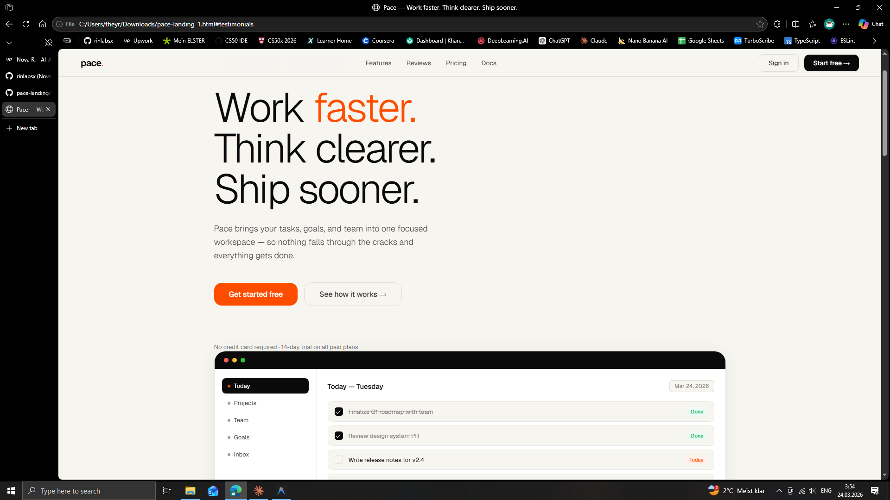

# Pace — Landing Page

A fully responsive SaaS landing page built for Pace, a fictional productivity and workflow tool for small teams. Demonstrates frontend design, copywriting, and layout skills across a complete marketing site.

**Live demo → [rinlabsx.github.io/pace-landing](https://rinlabsx.github.io/pace-landing)**

---

## What's included

- Sticky navigation with sign in and CTA
- Hero section with app mockup and animated headline
- Six-card features grid
- Testimonials section with reviews and social proof
- Three-tier pricing with featured plan
- High-contrast CTA section
- Footer

## Tech stack

- Vanilla HTML, CSS, JavaScript — no framework, no dependencies
- Single-file architecture, opens directly in any modern browser
- Fully responsive layout with CSS Grid and clamp() typography

## Design direction

Light paper background with a burnt orange accent. Clean, high-contrast typography using Geist for UI text. Deliberately different from dark-themed dashboards — built to show range across different client types and visual directions.

## Why this exists

This is a portfolio piece demonstrating customer-facing frontend development — layout composition, visual hierarchy, copywriting sensibility, and responsive design. The kind of marketing site a SaaS startup would commission before or alongside their product build.

Built by [Nova R.](https://www.upwork.com/freelancers/~0176f7c51b68d07c0e) — AI-Augmented Full-Stack Developer based in Germany.

---

## License

MIT
